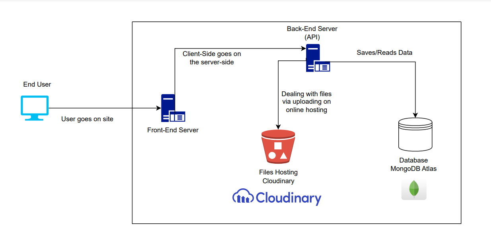

# ChatSphere


Full-Stack Chat Application Project using ReactJS and NodeJS.

---

### API Documentation

For detailed information about the API endpoints and usage, please refer to the [API Documentation](https://documenter.getpostman.com/view/32763635/2sA35MzzRV#e48a33f9-b1ed-4b32-8e2e-304ab8320391).

---

### Steps to Run

Currently, there are three environments available: `dev`, `test`, and `local`.

To use a database, you must specify one of the available environments in your script. Here's how to do it:

- For testing:

  ```bash
  npm run dev -- --environment=test
  ```

- For development:

  ```bash
  npm run dev -- --environment=dev
  ```

- For the local environment:

  ```bash
  npm run dev -- --environment=local
  ```

Make sure to apply the same approach for other scripts like `npm test` or `npm start`.

---

### Libraries and dependencies

#### Dependencies

| Library             | Version   |
|---------------------|-----------|
| [bcryptjs](https://www.npmjs.com/package/bcryptjs)          | 2.4.3    |
| [body-parser](https://www.npmjs.com/package/body-parser)    | 1.20.2   |
| [cloudinary](https://www.npmjs.com/package/cloudinary)      | 2.2.0    |
| [commander](https://www.npmjs.com/package/commander)        | 12.0.0   |
| [cors](https://www.npmjs.com/package/cors)                  | 2.8.5    |
| [dotenv](https://www.npmjs.com/package/dotenv)              | 16.4.5   |
| [express](https://www.npmjs.com/package/express)            | 4.19.2   |
| [joi](https://www.npmjs.com/package/joi)                    | 17.12.3  |
| [jsonwebtoken](https://www.npmjs.com/package/jsonwebtoken)  | 9.0.2    |
| [mongoose](https://www.npmjs.com/package/mongoose)          | 8.3.1    |
| [multer](https://www.npmjs.com/package/multer/v/1.4.3)      | 1.4.3    |
| [nodemailer](https://www.npmjs.com/package/nodemailer)      | 6.9.13   |
| [socket.io](https://www.npmjs.com/package/socket.io)        | 4.7.5    |
| [streamifier](https://www.npmjs.com/package/streamifier)    | 0.1.1    |

#### Dev Dependencies

| Library             | Version   |
|---------------------|-----------|
| [jest](https://www.npmjs.com/package/jest)                 | 29.7.0   |
| [nodemon](https://www.npmjs.com/package/nodemon)           | 3.1.0    |
| [supertest](https://www.npmjs.com/package/supertest)       | 6.3.4    |

### **IMPORTANT**

The `.env` contains all environment variables needed to run the project, a `.example.env` file is present with the fields needed, create a `.env` file based on the example and fill the fields with your credentials, **don't share these credentials publicly**

---

### Profiles

There are three different profiles available.

1. The *dev* environment.
2. the *test* environment.
3. the *local* environment.

---

### Front end

This repo contains the whole backend for ChatSphere, the frontend is in this [repo](https://github.com/MazenSamehR/ChatSphere/tree/master), it is also refrenced above.

---

### Technical Requiremnt Document



---

### Test modules

Test modules using the *jest* library for all APIs are available in the `tests` directory, to run the test use

```bash
npm run test -- --enviroment=test tests/{fileName}.test.js
# Example
npm run test -- --enviroment=test tests/groups.test.js 
```

---

### Note about the local environment

A docker compose file `docker-compose.yaml` is present this configures MongoDB in a docker conatiner with port mapping and volume mapping to save the data, change username and password to your preference.

Add the connection string to your `.env` file in the `MONGODB_CONNECTION_URL_LOCAL` field.

It should be like this

```mongosh
mongodb://<username>:<password>@localhost:27017/ChatSphere
```

**Remove the `<>` around the username and password**

---
